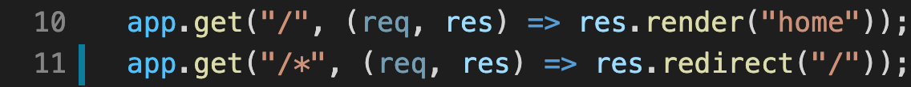

### request & response:

 


> 10: when user sends GET request to homepage, server respond with a template.

> 11: when user sends GET request to any page, server respond with a 'redirect'
___
### http:
- protocol, where all the servers work
    * `http://~~`
* **DOES NOT HAPPEN REAL-TIME**
    server has to get request _first_ in order to respond
* **stateless**: BE does not remember users 
    * no connection between the user & BE
     * After respond, BE forgets about the user(browser) and just wait for the next request. : reason why we use **cookie** or **session**

### Websocket :
*  another type of protocol that **allows real-time communication**
    * `ws://~~~`
* browser sends request -> server either accepts or deny that request.
* once it accepts, ***connection*** is established: 
    * server & user(browser) can communicate directly without request/response at any point. (bi-directional)
* connection can be between two BE servers

### WS: 
* websocket implementation for Node.js (library)
* it has the most basic, core feature of websocket
* install by using "npm i ws"
---
### Socket IO
* It is a framework:
    * helps building real-time connection btw FE and BE
    * uses ***WebSocket*** if the browser supports WebSocket
    * if not, uses ***HTTP long-polling***
* **is NOT an implementation of web socket**
* if there is problem with WS, it will try to reconnect automatically : gives **reliability**
___
### room: 
* groups of sockets that can communicate each other
* like chat rooms
* socketIO supports rooms natively
* join, leave, disconnecting
    * disconnecting: client is going to be disconnected, but not **yet leave the rooms**
 ```javascript
 //socketIO 의 기본 메서드
 socket.join("name of the room") //entering room
 socket.leave("name of the room") // leaving room
 socket.to("name of the room")  //sending msg to the whole room EXCEPT YOURSELF
 ```

```javascript
 //화면에 메세지를 보여주도록 하는 function
function addMessage(message){
    const ul = room.querySelector("ul");
    const li = document.createElement("li");
    li.innerText = message;
    ul.appendChild(li);
}
```
```javascript

function handleMessageSubmit(event){
    event.preventDefault();
    const input = room.querySelector("input");
    socket.emit("new_message", input.value, roomName, () => {
        addMessage(`You: ${input.value}`);
        input.value = "";
    });
 ```
 차이점: **callback을 부르는 시점이 message를 받고 난 후 이므로 두번째처럼 하면 addMessage() 에 빈 값이 들어감**  

```javascript
function handleMessageSubmit(event){
    event.preventDefault();
    const input = room.querySelector("input");
    socket.emit("new_message", input.value, roomName, () => {
        addMessage(`You: ${input.value}`);
    });
        input.value = "";
 ```

